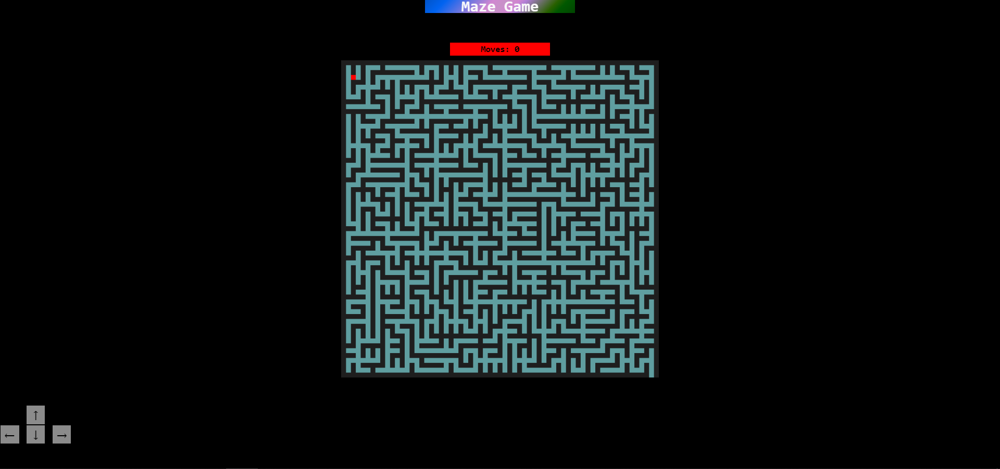

# Maze-1.0.0

This is Maze, a game. If you want to play it, you can open the index.html file with a browser.

Screenshot:



Video:
<video width="450" src="./Resources/example.mp4" autoplay>
---

If your also a coder like me and you want to put IT into your website then you need to do these steps:


1. Dump this into your html scripts: 

```html
<center>
        <div id="wrapper" style="margin-left:auto; margin-right:auto;">
            <h1 id="heading"
                style="text-decoration-style: solid; color: #F8F8F8; width: 15%;
                 margin-top: 0px; margin-bottom: 35px">
                Maze Game</h1><br>
            <div id="maze">
                <div id="c"
                    style="margin-left:auto; margin-right:auto;margin-bottom: 10px;text-align: center;width: 10%;font-size: large">
                </div>

                <canvas id="canvas" width="650" height="650" style="margin-left:auto; margin-right:auto">
                    This text is displayed if your browser does not support HTML5 Canvas.
                </canvas>
                <br>
                <button id="restart" onclick="
                if(playing == false){
                    document.location.reload()
                }
                ">Play Again?</button>
            </div>
            <!-- This is for phone -->
            <div id="controls">
                <button id="up" onclick="controls.up = true" >↑</button><br>
                <button id="left" onclick="controls.left = true">←</button>
                <button id="down" onclick="controls.down = true">↓</button>
                <button id="right" onclick="controls.right = true">→</button>
            </div>
            <!-- The Modal -->
            <div id="myModal" class="modal">
                <!-- Modal content -->
                <div class="modal-content">
                    <div class="modal-header">
                        <span class="close">&times;</span>
                        <h2 class="gamehead"></h2>
                    </div>
                    <div class="modal-footer">
                        <h2 id="demo" onmouseover="" style="cursor:pointer;">Play Again?</h2>
                    </div>
                </div>

            </div>


        </div>
    </center>
```
2. Then top it off with some Javascript:
```Javascript
// Import
import Maze from " The path to this folder + Exports.js "

// Make a new maze
var maze = new Maze()

// Setup and Draw the maze
maze.setup(true, 32)
maze.draw("canvas", "rgb(30, 30, 30)", "cadetblue")

// Draw the "Moves" for it
maze.drawMoves("c", true)

// Add the keyboard events (for fone and tablets)
maze.keyboard("up", "down", "left", "right")

// Add the style
maze.addCss()
```


---

## Others


All the properties are:
1. maze.setup(restarts, rowsAndColumns): Setup the maze, example:
```Javascript
maze.setup(true, 32)
```

2. maze.draw(CanvasId, walls, background): Draw the maze, example:
```Javascript
maze.draw("canvas", "rgb(30, 30, 30)", "cadetblue")
```
3. maze.drawMoves(id, color): Draw the moves, example:
```Javascript
maze.drawMoves("Moves", true)
```
4. maze.moves: The moves.

5. maze.keyboard(upId, downId, leftId, rightId): The keyboard for touchscreens, example:
```Javascript
maze.keyboard("up", "down", "left", "right")
```
6. maze.addCss(): Add the style.

```diff
- IMPORTENT
+ If your code didn't work then check the console! 

If you have this error:
- Access to script at '(path)' from origin 'null' has been 
- blocked by CORS policy: Cross origin requests are only supported for
- protocol schemes: http, data, isolated-app, chrome-extension, chrome, https, chrome-untrusted.
``` 

Then run this in you terminal or run cmd.exe
```bash
npm create vite@latest
```

do the steps and run this:
```bash
cd "the path to you project"
npm install
npm run dev
```

open the project and edit the index.html, script.js, style.css!


<span style="color: red;">NOTE!</span> You have to have [node.js](https://nodejs.org/en/download/) up and running to install [vite](http://www.vitejs.dev/)!

My Site Is [here!](http://www.vucodepro.com)

